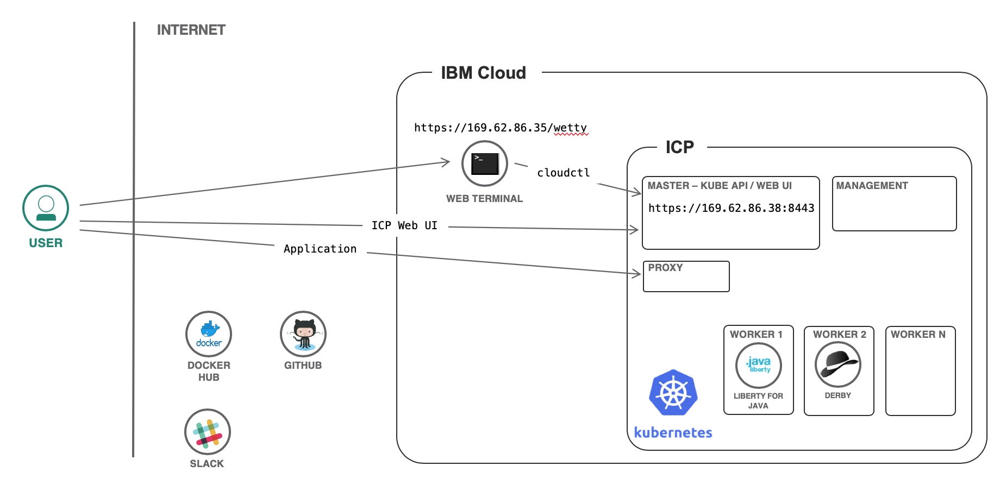

# ICP / k8s Workshop hosting environment for clients

When an enterprise client has asked for a workshop with support for k8s and/or ICP, one option is to create an instance of IBM Cloud Private on Softlayer. This collection of terraform configuration files and supporting scripts is designed to speed the deployment of an architecture like:



Deployment requires an IBM Cloud account that has the ability to provision vm's on Softlayer for the hosting of ICP, ldap server and the vm for the developer client users.

In this configuration, dynamic storage provisioning is supported through running an NFS server pod on the cluster using the nfs-provisioner external storage provider project. To support this, the master node is configured with an additional disk providing 200 GB of storage by default. If additional storage is required, the master node configuration `disk_size` in `ibmcloud-icp/variables.tf` can be increased. The first 200 GB in the disk are used for ICP storage and any remaining capacity is configured to be mounted on `/storage` of the master node and set as the volume for use by the NFS server pod used for the dynamic storage provisioner.

Currently, there are three separate directories for the terraform deployments to provide modularity. General flow for creating the entire environment is as follows:

1. Initial preparation

1. Create the ICP environment

1. Create the LDAP directory and populate with users

1. Create the developer vm host

1. Configure ICP instance, add LDAP definition, add dynamic storage provisioner, adjust pods allowed per core and set up web terminal application

1. *Optional* set up web terminal hosted in ICP using helm chart

## Initial preparation

Follow steps from [softlayer setup](deploy-ibmcloud-terraform.md) to get SL parameters needed for configuring the respective `variables.tf` files for the deployments.

The script to create a csv file pre-populated with users requires an installed copy of [jq](https://stedolan.github.io/jq/) . The automation scripts that set up the LDAP server and populate users on the developer vm require a relatively recent (2.4 or later) version of [ansible](https://docs.ansible.com/ansible/latest/installation_guide/intro_installation.html) to be installed on the host running the installation.

## Create the ICP environment

Change to the `ibmcloud-icp` folder.
`terraform apply` (takes about 40 mins to fully deploy). 
Scroll up in the output to find the URL for the dashboard just below the "POST DEPLOY MESSAGE ************" line. Log in to the ICP cluster using the user `admin` and the password set in the `variables.tf` file.

## Create the LDAP directory and populate with users

Change to the `ldap` folder and use terraform apply to create vm. Obtain the public and private IP address for the ldap server by using the: `terraform show | grep ipv4` command. Make a note of these for use in future steps.
Use script in the [users/README.md](users/README.md) file to set up the ldap server and add users.

## Create the developer vm host

change to the `devvm` folder.
Update the `devvm/postinst.sh` file, setting the IP address for the ICP Master. Obtain the public and private IP address for the ldap server by using the: `terraform show | grep ipv4` command.Deploy using terraform. Use script described in [users/README.md](users/README.md) to add the users to the developer vm system.

## Finish configuration of the ICP instance

From the `users` folder run the script to configure ICP connection to ldap and add ldap users to the cluster:

```
../scripts/configICP.sh -c=<CLUSTER_URL> -ip=<LDAP_PRIV_IP> [--icp-admin-password=<ICP_ADMIN_PASSWD>] [--ldap-admin-password=<LDAP_ADMIN_PASSWORD>]
```

Where `CLUSTER_URL` is the ICP Cluster console URL, `LDAP_PRIV_IP` is the 10. ip address for the ldap server,  `ICP_ADMIN_PASSWORD` is the password set for the `admin` user in the `variables.tf` file, and `LDAP_ADMIN_PASSWORD` is the ldap administrator password. The script defaults these to values set in the configuration files and are only required if the defaults are changed.

To allow images in general to be pulled from the CoreOS and Docker Hub image repositories, from the ICP Console, navigate to **Manage->Resource Security->Image Policies** and add a policy permitting access from `quay.io/*` and `docker.io/*` 

Configure dynamic storage provisioning using the [nfs provisioner](ibmcloud-icp/nfs-provisioner/README.md) **Note** the rbac configuration presumes that the deployment will be in the `default` namespace.

Fix the pods-per-core default of 10, updating to 30. This can be repeated if the cluster is scaled to add additional workers with terraform.

```
# get the hosts from the ICP master to use for the ansible inventory
scp root@<master.IP>:/opt/ibm/cluster/hosts icp-hosts
ANSIBLE_HOST_KEY_CHECKING=False ansible-playbook -i icp-hosts ../scripts/updatePodsPerCore.yml
```

## Configuring web terminal in ICP

A web terminal can be configured to run in the cluster and redirect connections to the developer vm. The web terminal is based on code from the [WebTTY project](https://github.com/krishnasrinivas/wetty). Obtain the internal IP address from the developer vm using:

```
cd devvm
export DEVVM_PRIV=$(terraform show | grep "ipv4_address_priv" | cut -d " " -f5)
cd ..
```

Log in to the cluster with cloudctl to enable helm (preferrably as an admin user) and select the `default` namespace. Deploy the chart:

```
cd charts
helm install --name myterm --set ssh_host=$DEVVM_PRIV wetty --tls
```
