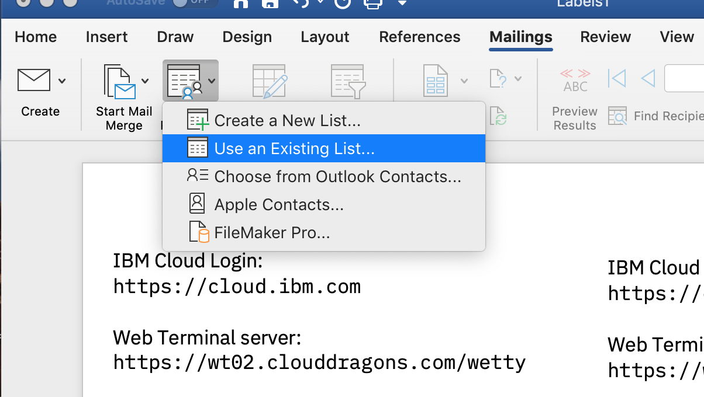

# Cluster user setup commands

## Create list of users 

By default, these scripts create a csv file for the users called `users.csv`. This can be overridden by specifying a different output file from the creation script, and different input files for the ldap and developer vm scripts. Example creates a list of 50 users

```
../scripts/createUserCsv.sh -n=50
```

## Add ldap server with users

Run script to start ldap container and populate with user files. update parameters as desired, including IP address for ldap server. Default credential value set in script are shown as examples. After the ICP cluster has been configured to use the LDAP server, the icp admin user suser001 will use the password set with icp-admin-password.

```
../scripts/configLdap.sh -ip=169.62.86.34 --ldap-admin-password=aT0pSecr8t --icp-admin-password=Time4fun
```

After completion, it is optional to ssh to the ldap system and verify directory entries with:

```
ldapsearch -x -H ldap://localhost -b dc=icp -D "cn=admin,dc=icp" -w <the-ldap-admin-password>
```

## Add users to developer vm

Run script providing the IP address for the Developer VM (public interface)

```
../scripts/configDevvm.sh -ip=169.62.86.40
```

Update the word doc merge file with the data from users.csv and then do a merge export if you want to print out cards to hand out to users.

## Create "print out forms" for user credentials:

Open the `AppModCreds.docx` file. Update the credentials file columns with the desired information for your workshop. Remove any blank lines in the table… Extras are there to make it easy to go beyond 100… (edited) 
then - open the `AppModUsers-Merge` file and go to the Mailings tab. Select **Select Recipients->Use an Existing List…**



Choose the AppModCreds.docx file. At this point, preview the first page by clicking **Preview Results** from the Mailings tab.
If all looks good, select **Finish & Merge** and either choose **Edit Individual Documents** if you want an editable file with all of the merges that you can save as a PDF, or choose **Print Documents…**  to start a print job with the contents.
